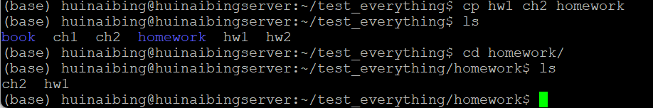
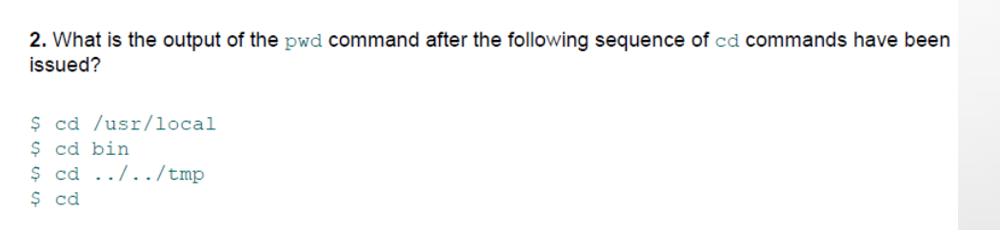

# 夏秋雨 2024112200

### Q1


文件名字前面带`.`的都是隐藏文件，使用`ls -a`可以查看这些文件


---

### Q2


没有区别，符号`-`后面的每一个字母都代表一种操作

`-l`为一行列一个文件


`-a`为显示所有文件包括以点`.`开头的文件


> 双横线后面跟一个单词，这一整个单词为一个操作

```
ls -al
```


```
ls -l -a
```


```
ls -la
```


---

### Q3


分别是`-l`和`-m`


示例：

```
cat autoPush.sh
```


```
wc -l autoPush.sh
```


```
wc -m autoPush.sh
```


---

### Q4


```
cp hw1 ch2 homework
```



不会报错，cp将两文件移入了homework文件夹


```
cp hw1 homework hw2 book
```


由于没有-r参数，所以文件夹不会被复制

> 加了-r就可以复制了
>
> 


```
rm hw1 homework ch1
```


要加-r才能删掉文件夹

> `rm -r book homework`
>
> 


```
rm hw2 ch2
```


删掉了

---

### Q5


1，4是绝对路径，2、3是相对路径

---

### Q6



1. 输出为`/usr/local`，cd后面的是绝对路径
2. 输出为`/usr/local/bin`，这是个相对路径
3. `/usr/tmp`
4. `/home/用户名`


---

### Q7


操作这个文件夹要root权限

```
# 创建文件夹
sudo mkdir -p /opt/pgms
# 复制文件
sudo cp -r /usr/local /opt/pgms
```

---

### Q8


由于这个文件夹里面内容比较重要，故移动完后需要创一个链接，否则会出问题

```
# 创建文件夹
sudo mkdir -p /opt/pgms
# 移动
sudo mv /usr/local /opt/pgms/
# 创建链接
sudo ln -s /opt/pgms/local /usr/local
```

---

### Q9


如图


显然，直接使用`rmdir backup`会报错，因为文件夹非空


可以使用`rm -r backup`删除它


---

### Q10


1. 第一个是c，字符类型文件，第二个是普通文件，第三个是文件夹，第四个是普通文件
2. 在输出的每行的第三个位置是文件的owner，第四个位置是group
3. 第一个文件，owner可读、可写、不可执行，group只能读，other都不行
   第二个文件，所有人都可读，但都不能写和执行
   第三个所有人都能读、写、执行（但这是个文件夹所以执行没意义）
   第四个文件显然出题人打错字了，所有人都可读、可执行、不可写