# 夏秋雨 2024112200

> 使用Linux版本：ubuntu-24.04.2-live-server-amd64

### Q1


1. 使用`&`
2. 使用`bg`指令


如图：start_clash.sh为前台指令

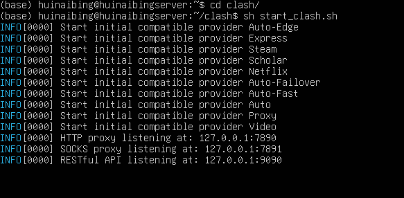

> 使用`&`，如图，可正常执行其他指令
>
> 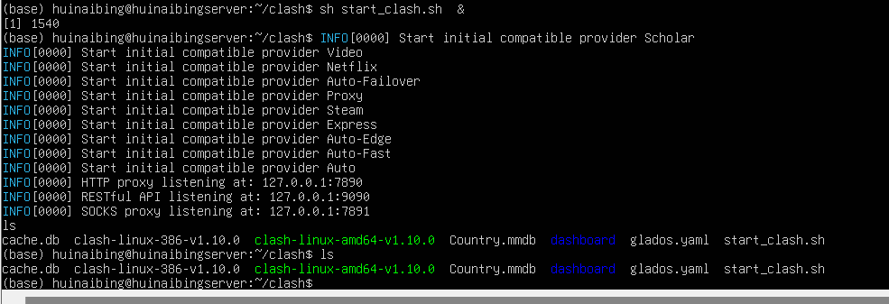
>
> 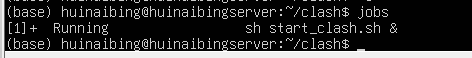


> 使用`ctrl + z`后使用`bg`，如图
>
> 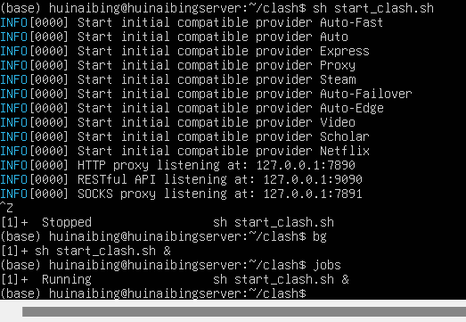

---


### Q2


使用jobs查看后台命令，使用ps查看所有运行的进程

> `jobs`
>
> 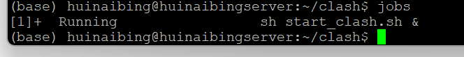
>
> `ps`
>
> 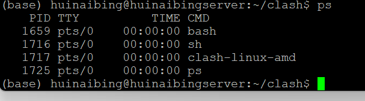
>
> `ps -f` 显示进程的详细信息
>
> 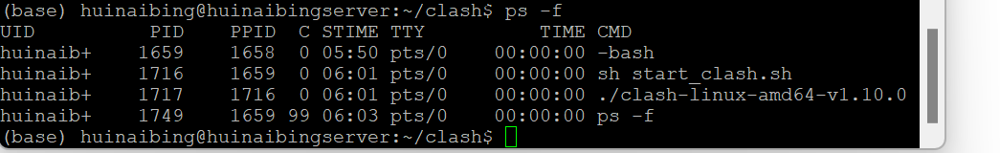
>
> `ps -u <username>` 显示某个用户的进程
>
> 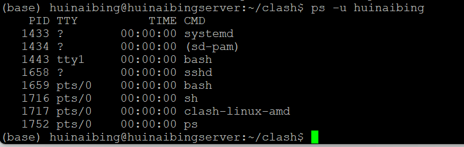


### Q3


使用`bg %<number>`指定某一个进程后台运行

如图，使用两示例程序


如图，先运行程序，后`ctrl+z`后，使得两程序在后台停止，此时使用`bg %<number>`可以指定某一个程序在后台运行

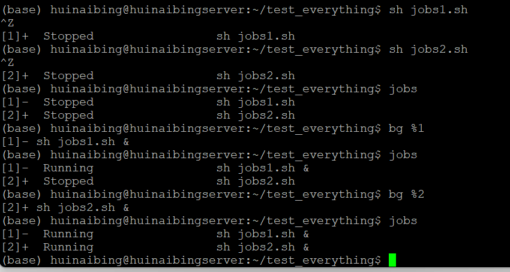

---


### Q4


只能以字母和下划线开头，所以第二个是错的


### Q5


```
# 取第五个item
adams[4]

# 取所有item
adams[@]
adams[*]
```

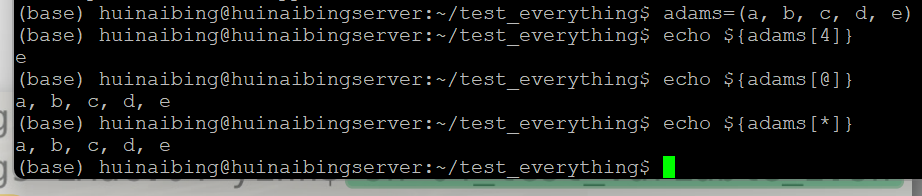

---


### Q6


```
# ?为匹配单个任意字符
ls ./hw???.???
```

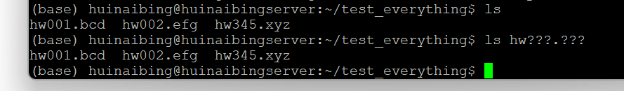

---


### Q7


> result为10，因为shell没有浮点数，小数部分直接舍去
>
> 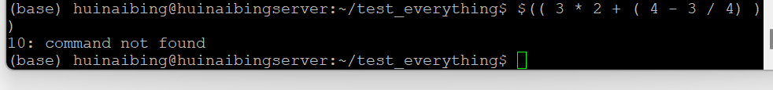

---


### Q8


```
echo "It's <party> time!"
```

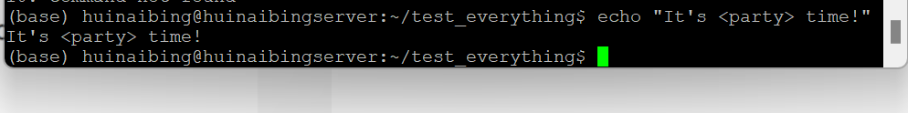

---


### Q9


- 输出$USER

```
# 花括号带不带都行
echo ${USER}
```

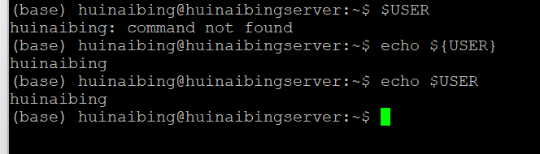

- 输出单个空格

```
# 冒号中间有个空格
echo " "
```

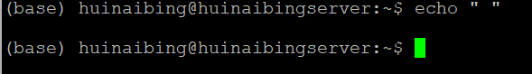

> 下面证明这个指令真的输出了一个空格虽然看不见
>
> 使用`echo -n " "`来使得该次输出不换行，然后再输出一个任意字符，看这个字符位置即可
>
> 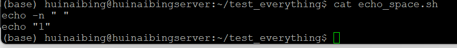
>
> 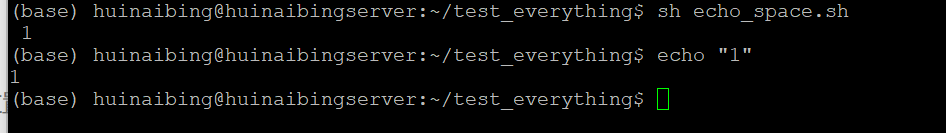

- 输出owes

```
echo owes
```

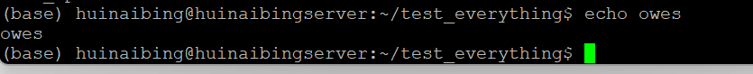

- 输出五个空格

```
# 冒号中五个空格
echo "     "
```

> 证明过程和上面那个一样
>
> 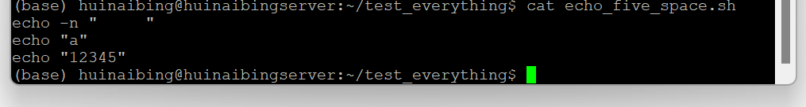
>
> 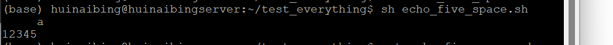

- 输出美元符号

```
# 显然使用转义符号就可以了
echo "\$"
```

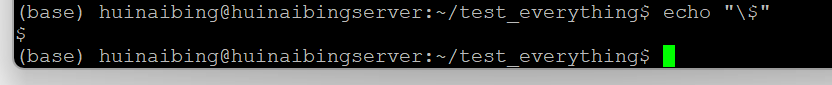

-  输出$DEBT

```
echo $DEBT
```

