# 夏秋雨2024112200

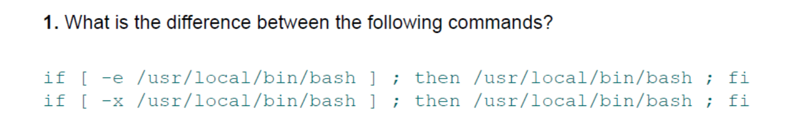

第一个命令是文件存在就返回true，第二个是文件存在且可执行就返回true，显然若用户没有bash的运行权限的时候，第二个if的条件就是false

---

---

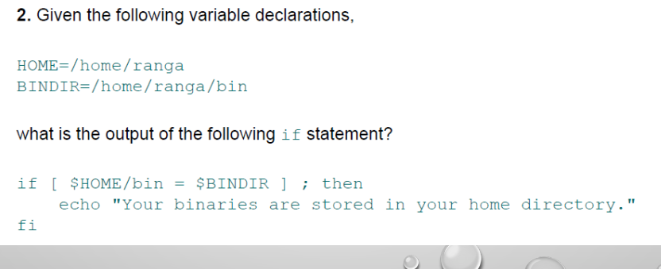

在条件判断中进行了两个字符串的比较，`$HOME/bin`的值为`/home/ranga/bin`，显然该值和后面的`$BINDIR`是一样的，所以if中的条件为真，if中的语句会正常执行，如图

`home_bindir.sh`

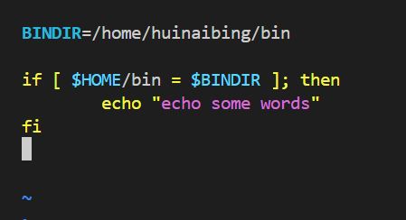

输出结果

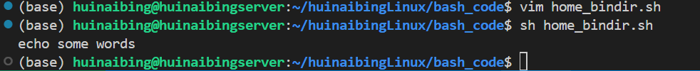

---

---


查找test的文档可以看到


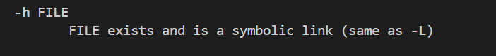

`test_dir_sl.sh`

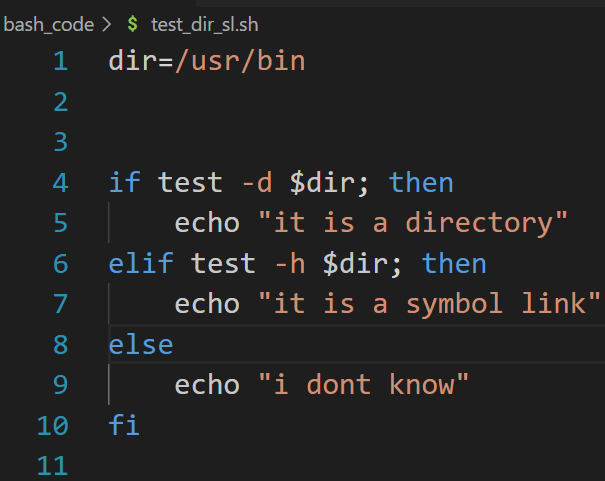

输出结果

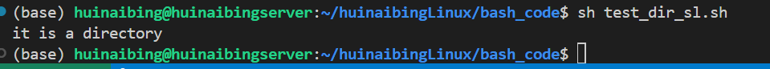

---

---

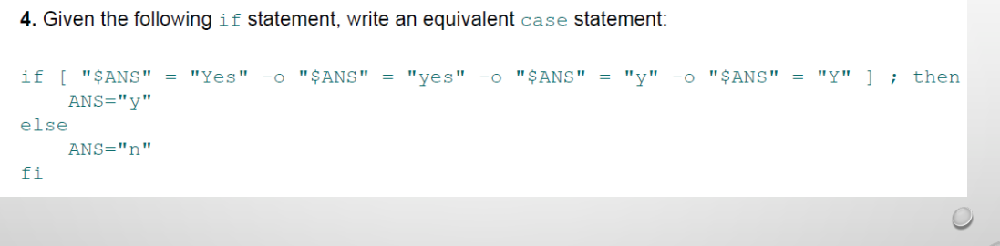

显然，题目的意思是，如果$ANS的意思是“同意”那么就把它的值改为y，否则把它的值改为n

`change2case.sh`

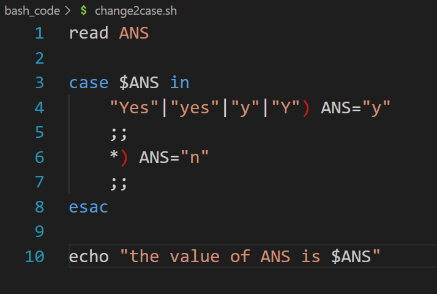

结果：

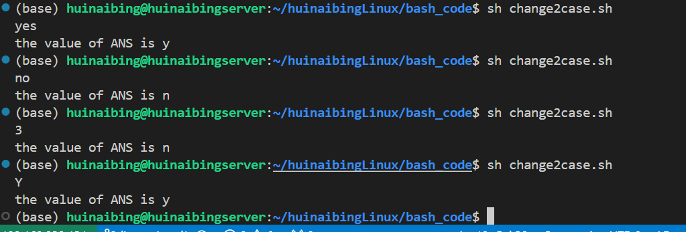

---

---

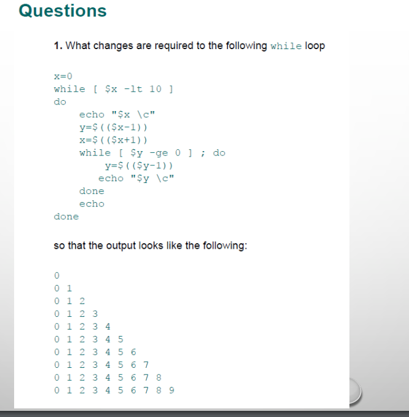

图中程序的原本输出如图

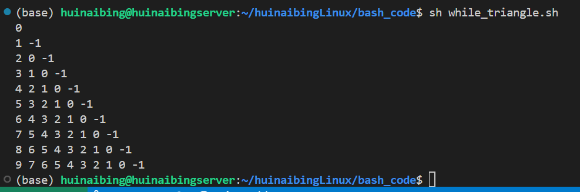

显然，简单地改一下就行了

`while_triangle.sh`

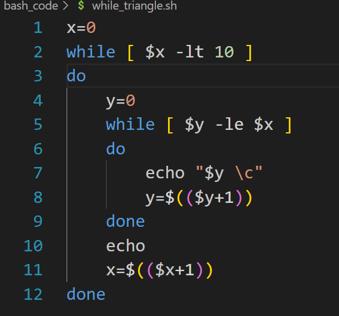

output:

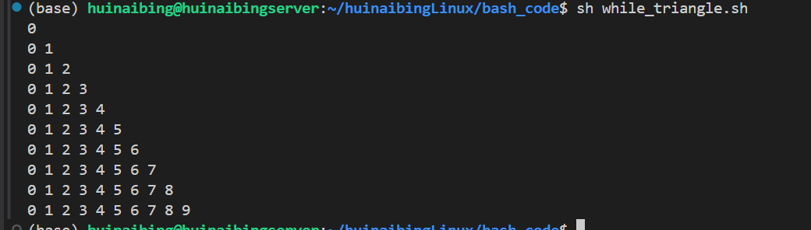

---

---

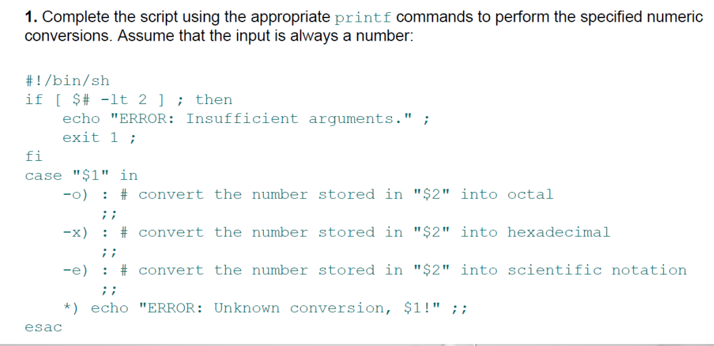

`printformat.sh`注释写在下面了

```sh
#! /bin/bash
# 由于使用了字符串切片操作，这个玩意是bash才有的
# 所以这里要改成使用bash

if [ $# -lt 2 ]; then
# 若传入的参数不足两个则退出
    echo "insufficient args"
    exit 1
fi


convert2oct()
# 转换数为八进制数
# 实测sh的内部函数无法读取传给文件的位置变量，所以还需要给函数传参数，
# 这个传递方法和位置变量是一样的
{
    echo "convert to oct, origin num $1"

    # 这里初始化一个空串，以方便后续的拼接，并且用一个tmp拷贝$1的值
    str=""

    # 这个if干的事情就是判断待处理数据是正数还是负数，
    # 负数处理的时候要把负号提出去
    Flag="+"
    if [ $1 -lt 0 ]; then
        tmp=$((0-$1))
        Flag="-"
    else
        tmp=$1
    fi

    while [ $tmp -ne 0 ]
    # 这个求八进制数的算法大家都知道，不赘述了
    do
        str="$(($tmp % 8))"$str
        tmp=$(($tmp / 8))
    done
    printf "the num cvrt2 oct is %s%s \n" $Flag $str
}

convert2hex()
# 转换为16进制数
# 由于16进制中有ABCDEF，所以加了个CASE，其他地方和八进制没区别
{
    echo "convert to hex, origin num is $1"
    str=""
    Flag="+"

    # 这个if干的事情就是判断待处理数据是正数还是负数，
    # 负数处理的时候要把负号提出去
    if [ $1 -lt 0 ]; then
        tmp=$((0-$1))
        Flag="-"
    else
        tmp=$1
    fi

    while [ $tmp -ne 0 ]
    do
        rest_num="$(($tmp % 16))"
        case $rest_num in 
            "10") str="A"$str
            ;;
            "11") str="B"$str
            ;;
            "12") str="C"$str
            ;;
            "13") str="D"$str
            ;;
            "14") str="E"$str
            ;;
            "15") str="F"$str
            ;;
            *) str=$rest_num$str
        esac
        tmp=$(($tmp / 16))
    done
    printf "the num cvt2 hex is %s%s \n" $Flag $str
}

convert2sci()
# 转换为科学计数法
# 这里要字符串切片，所以要用bash
{
    echo "convert2sci, origin number is $1"

    Flag="+"
    # 这个if干的事情就是判断待处理数据是正数还是负数，
    # 负数处理的时候要把负号提出去
    if [ $1 -lt 0 ]; then
        tmp=$((0-$1))
        Flag="-"
    else
        tmp=$1
    fi

    strlen=0
    while [ $tmp -ne 0 ]
    # 这个while用于计算字符串的长度
    do
        strlen=$(($strlen + 1))
        tmp=$(($tmp / 10))
    done

    if [ $strlen -eq 1 ]; then
    # 如果字符串的长度为1，那就没有后面的事情
        echo "the num cvrt2 sci is $1"
        return 0
    fi

    str=""

    if [ $1 -lt 0 ]; then
        tmp=$((0-$1))
    else
        tmp=$1
    fi

    exact_num=2
    # 这个是精确到小数点后几位

    for i in `seq $exact_num`
    # 使用切片去取小数
    do
        if [ $i -eq $strlen ]; then
        # 如果字符串不够长就跳出循环
            break
        fi
        str=$str"${tmp:$i:1}"
    done

    if [ $1 -lt 0 ]; then
        tmp=$((0-$1))
    else
        tmp=$1
    fi
    printf "the num cvrt2 sci is %s%d.%s X 10^%d \n" $Flag ${tmp:0:1} $str $(($strlen-1))
}

case $1 in
# 通过case去调用函数
    -o) # 转换8进制
        convert2oct $2
    ;;
    -x) # 转换16进制
        convert2hex $2
    ;;
    -e) # 科学技术法
        convert2sci $2
    ;;
    *) 
        echo  "error"
        exit 2
esac
```

效果演示

```
./printformat.sh -o 15
# 将15转为8进制
```

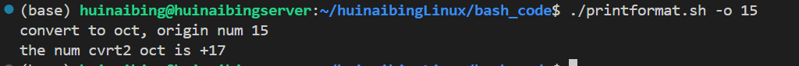

```
./printformat.sh -o -17
# 将-17转为8进制
```

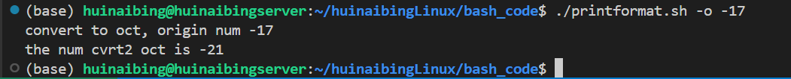

```
./printformat.sh -x 18
# 将18转为16进制
```

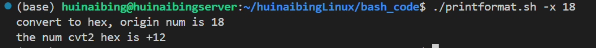

```
./printformat.sh -x -19
# 将-19转为16进制
```

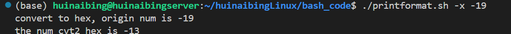

```
./printformat.sh -e 114514
# 将114514转为科学计数法
```

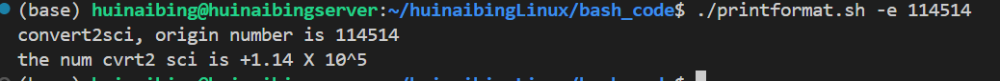

```
./printformat.sh -e -1919810
# 将-1919810转为科学技术
```

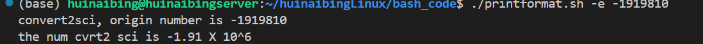

---

---

