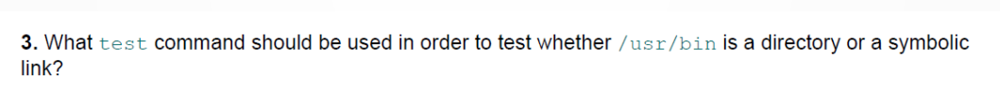
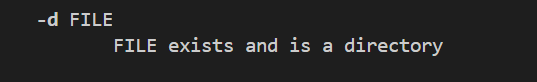

# 夏秋雨2024112200

第一个命令是文件存在就返回true，第二个是文件存在且可执行就返回true，显然若用户没有bash的运行权限的时候，第二个if的条件就是false

---

---

在条件判断中进行了两个字符串的比较，`$HOME/bin`的值为`/home/ranga/bin`，显然该值和后面的`$BINDIR`是一样的，所以if中的条件为真，if中的语句会正常执行，如图

`home_bindir.sh`

输出结果

---

---

查找test的文档可以看到

`test_dir_sl.sh`

输出结果

---

---

显然，题目的意思是，如果$ANS的意思是“同意”那么就把它的值改为y，否则把它的值改为n

`change2case.sh`

结果：

---

---

图中程序的原本输出如图

显然，简单地改一下就行了

`while_triangle.sh`

output:

---

---

`printformat.sh`注释写在图中的文件里了

---

---

