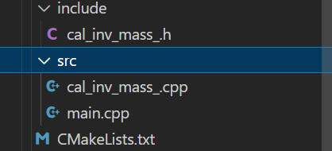
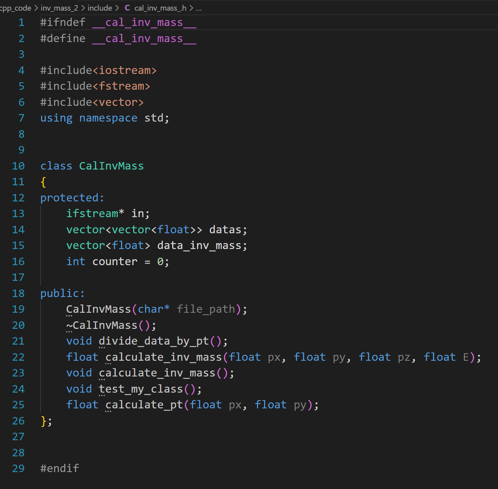
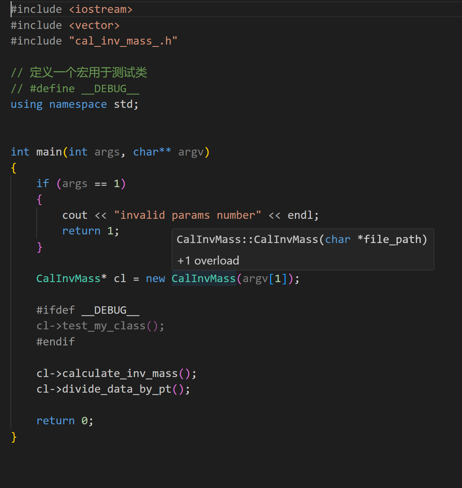
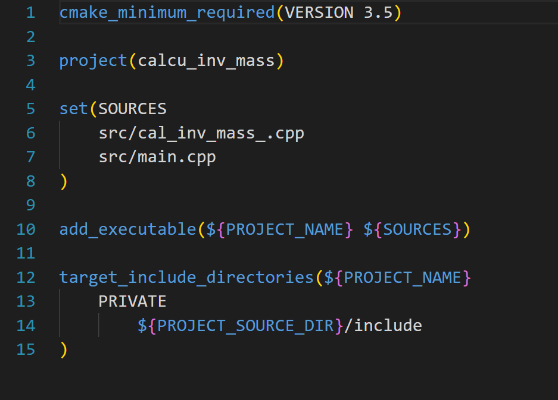
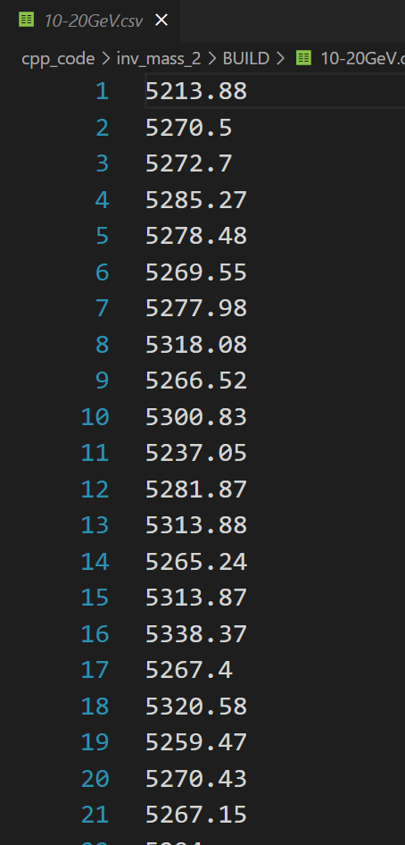
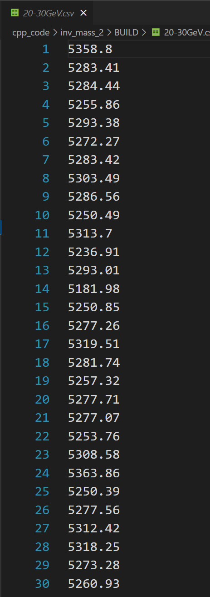
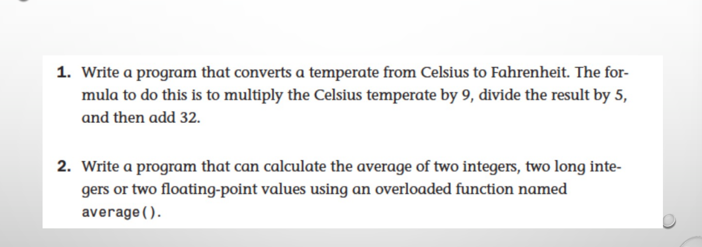
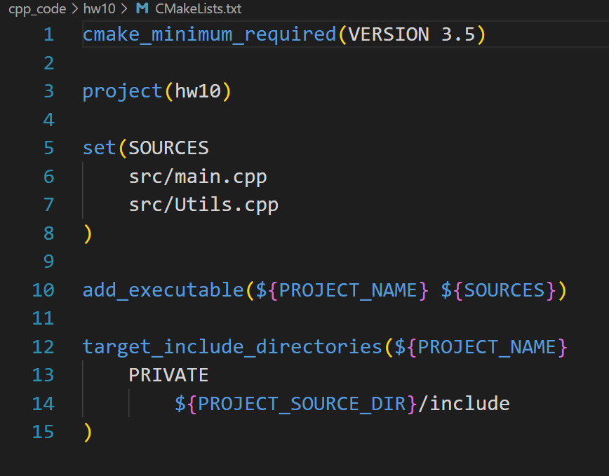
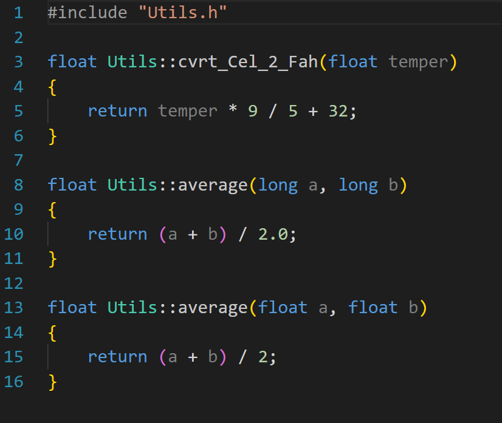
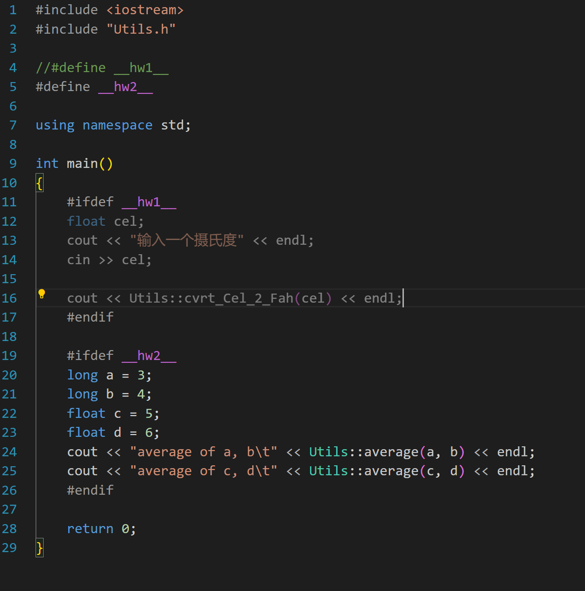

# 夏秋雨 2024112200

> 作业代码已提交于GitHub https://github.com/huinaibing/huinaibingLinux/tree/master/cpp_code
>
> 若有疑问请`git clone https://github.com/huinaibing/huinaibingLinux.git`
>
> *仓库是private的*


> 项目结构



> `cal_inv_mass_.h`



> `cal_inv_mass_.cpp`

```c++
#include "cal_inv_mass_.h"
#include <fstream>
#include <math.h>
CalInvMass::CalInvMass(char* file_path)
// 把文件读入二维vector中
{
    this->in = new ifstream(file_path);

    string _;
    float px;
    float py;
    float pz;
    float E;

    while (!this->in->eof())
    {
        vector<float> tmp;
        *in >> _ >> px >> py >> pz >> E;
        tmp.push_back(px);
        tmp.push_back(py);
        tmp.push_back(pz);
        tmp.push_back(E);
        this->datas.push_back(tmp);
        this->counter += 1;
    }
    
}

CalInvMass::~CalInvMass()
{
    this->in->close();
}

void CalInvMass::test_my_class()
// 测试这个类，如果output和原本输入两文件数据是一样的话那就没有问题
{
    ofstream out("text.output");
    for(int i=0; i < this->counter; i++)
    {
        for (int j = 0; j < 4; j++)
        {
            out << this->datas[i][j] << "\t";
        }
        out << endl;
    }
    out.close();
}

void CalInvMass::divide_data_by_pt()
{
    ofstream out1("0-10GeV.csv");
    ofstream out2("10-20GeV.csv");
    ofstream out3("20-30GeV.csv");
    ofstream out4("30-40GeV.csv");
    float pt;

    for (int i = 0; i < this->counter; i++)
    {
        pt = this->calculate_pt(this->datas[i][0], this->datas[i][1]);

        if (pt < 10000)
        {
            out1 << this->data_inv_mass[i] << endl;
        }
        else if (pt < 20000)
        {
            out2 << this->data_inv_mass[i] << endl;
        }
        else if (pt < 30000)
        {
            out3 << this->data_inv_mass[i] << endl;
        }
        else
        {
            out4 << this->data_inv_mass[i] << endl;
        }
    }

    out1.close();
    out2.close();
    out3.close();
    out4.close();
}

float CalInvMass::calculate_inv_mass(float px, float py, float pz, float E)
// 计算inv mass，使用公式计算
{
    return sqrt(pow(E, 2) - pow(px, 2) - pow(py, 2) - pow(pz, 2));
}

void CalInvMass::calculate_inv_mass()
// 从类中的二维vector读入数据，计算完成后放入类中
{
    for (int i=0; i < this->counter; i++)
    {
        this->data_inv_mass.push_back(
            this->calculate_inv_mass(
                this->datas[i][0],
                this->datas[i][1],
                this->datas[i][2],
                this->datas[i][3]
            )
        );
    }
}

float CalInvMass::calculate_pt(float px, float py)
{
    return sqrt(pow(px, 2) + pow(py, 2));
}
```

> `main.cpp`



> `CMakeLists.txt`



> 运行结果







---

---



### 由于这两作业太简单了我就给他写一起了

> 项目结构


> CMakeLists.txt



> Utils.h


> Utils.cpp



> main.cpp

### 注意到这里使用#define去控制执行不同代码



## 作业1 摄氏度和华氏度的转换


## 作业2 overload的使用

