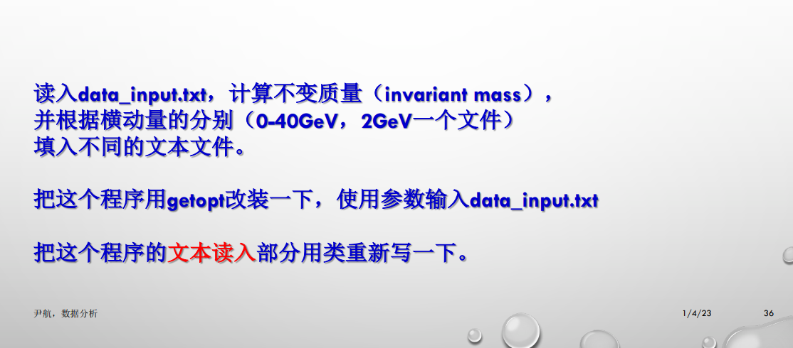
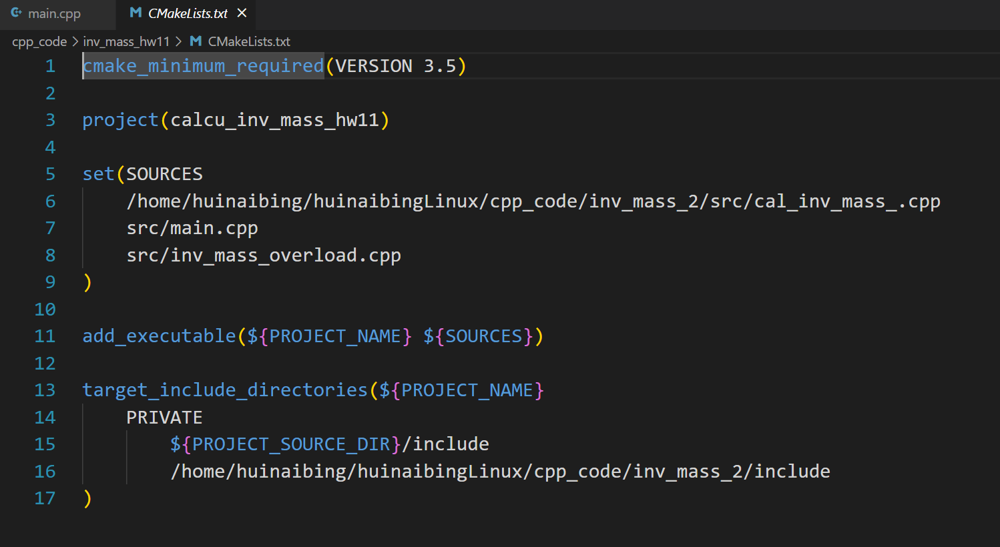
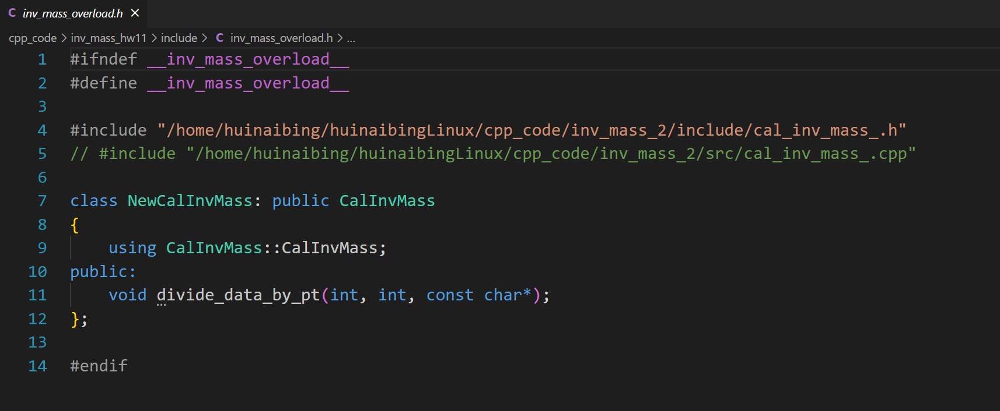
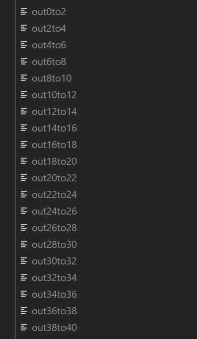
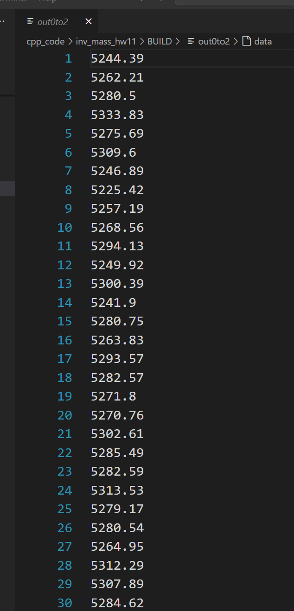
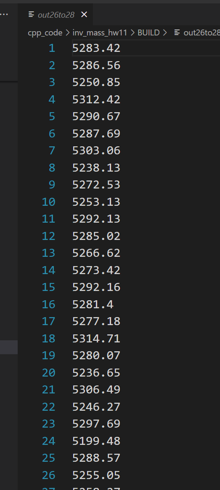

# 夏秋雨 2024112200

> 代码已上传GitHub
>
> 有疑问请`git clone https://github.com/huinaibing/huinaibingLinux.git`



### 注意，由于第10个ppt的作业在写的时候已经满足本次（第11个ppt）作业的绝大部分要求，故把上次作业的类继承然后overload了部分函数，使其符合本次作业要求；

### 部分代码请参照第10次ppt的作业pdf，*这两作业是一起交的*

> 项目结构


> CMakeLists.txt



> inv_mass_overload.h



> inv_mass_overload.cpp

```c++
#include "inv_mass_overload.h"
#include "/home/huinaibing/huinaibingLinux/cpp_code/inv_mass_2/include/cal_inv_mass_.h"
#include <fstream>
#include <iostream>
#include <vector>

// #define __DEBUG__
using namespace std;


void NewCalInvMass::divide_data_by_pt(int range=40, int gap=2, const char* basename="output")
// 默认0-40GeV 每2GeV一个文件
{
    vector<ofstream*> file_outers;
    
    for (int i = 0; i < range; i +=gap)
    {
        string name(basename);
        name += to_string(i);
        name += string("to");
        name += to_string(i + gap);
        file_outers.push_back(new ofstream(name));
    }

    int divider;
    for (auto i: this->datas)
    {
        divider = this->calculate_pt(i[0], i[1]) / (gap * 1000);

        if (divider >= range / gap)
        {
            continue;
        }

        #ifdef __DEBUG__
        cout << divider << endl;
        #endif

        *file_outers[divider] << this->calculate_inv_mass(i[0], i[1], i[2], i[3]) << endl;
    }

    #ifdef __DEBUG__
    cout << "------";
    #endif
    for (ofstream* i: file_outers)
    // 关闭文件
    {
        i->close();
    }
}

```

> main.cpp

```cpp
#include <iostream>
#include<unistd.h>
#include <string.h>
#include "inv_mass_overload.h"
#include "/home/huinaibing/huinaibingLinux/cpp_code/inv_mass_2/include/cal_inv_mass_.h"

// #define __DEBUG__
using namespace std;

int main(int argc, char** argv)
{
    char ch;
    char* input_file_name = new char[256];
    char* output_file_name = new char[256];

    while((ch = getopt(argc, argv, "i:o:")) != -1)
    {
        switch (ch)
        {
            case 'i':
                #ifdef __DEBUG__
                cout << "i " << optarg << endl;
                #endif

                // input_file_name = string(optarg);
                strncpy(input_file_name, optarg, 255);
                
                break;
            case 'o':
                #ifdef __DEBUG__
                cout << "o " << optarg << endl;
                #endif
                
                // output_file_name = string(optarg);
                strncpy(output_file_name, optarg, 255);

                break;
            default:
                cout << "invalid parms" << endl;
                return 127;
        }
    }

    #ifdef __DEBUG__
    cout << input_file_name << "  ";
    // cout << output_file_name << endl;
    #endif

    #ifdef __DEBUG__
    CalInvMass* Cl = new CalInvMass("data_input.txt");
    Cl->test_my_class();
    #endif


    NewCalInvMass* Ctrler = new NewCalInvMass(input_file_name);

    Ctrler->divide_data_by_pt(40, 2, output_file_name);

    #ifdef __DEBUG__
    cout << "-----" << endl;
    //Ctrler->test_my_class();
    #endif
    return 0;
}
```

> 结果





