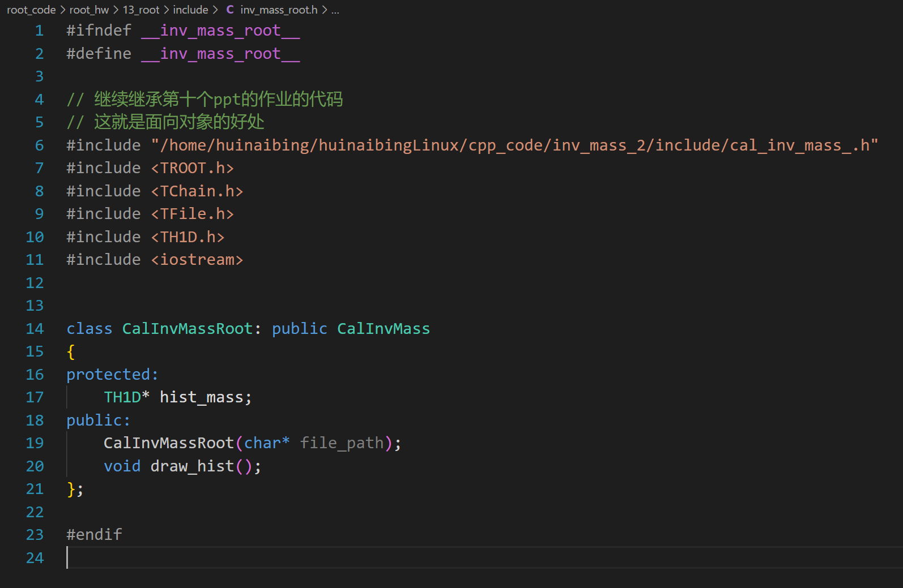
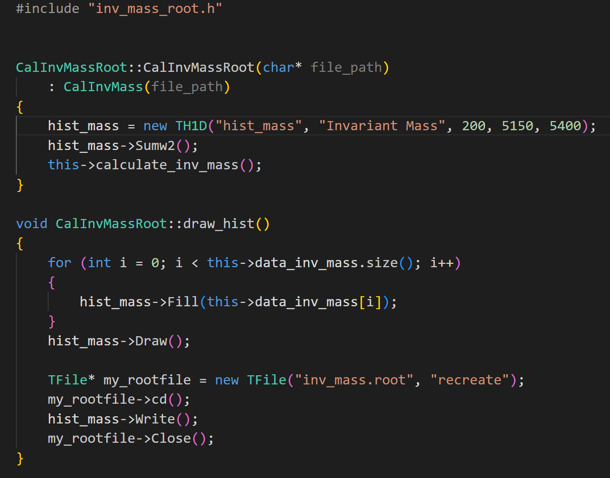
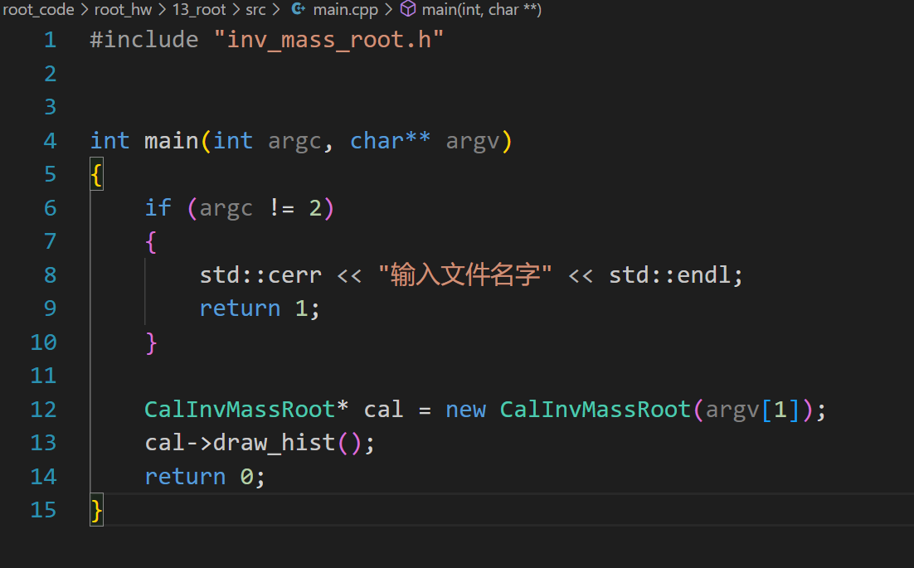
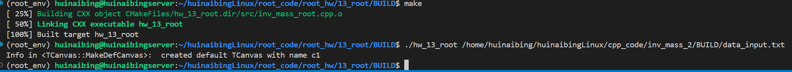
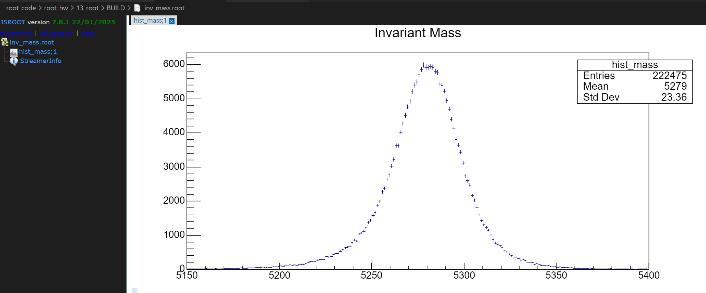

# 夏秋雨 2024112200

> 代码已备份在github 
>
> `git clone https://github.com/huinaibing/huinaibingLinux.git`


> 由于之前的计算不变质量的cpp作业已经完成大部分功能了，故直接使用继承，并添加一些函数以达到本作业的要求

### 项目结构


### CMakeLists.txt

```cmake
cmake_minimum_required(VERSION 3.5)

project(hw_13_root LANGUAGES CXX)

# 以下两行为需要用root的时候添加，下面link lib同理
find_package(ROOT REQUIRED COMPONENTS Core Tree RIO Net Hist MathCore Graf Physics)
include(${ROOT_USE_FILE})
# end


set(SOURCES
    /home/huinaibing/huinaibingLinux/cpp_code/inv_mass_2/src/cal_inv_mass_.cpp
    src/main.cpp
    src/inv_mass_root.cpp
)

add_executable(${PROJECT_NAME} ${SOURCES})

target_include_directories(${PROJECT_NAME}
    PRIVATE
        ${PROJECT_SOURCE_DIR}/include
        /home/huinaibing/huinaibingLinux/cpp_code/inv_mass_2/include
)


# 需要root的时候添加
target_link_libraries(${PROJECT_NAME}
    PRIVATE
        ROOT::Core
        ROOT::Tree
        ROOT::RIO
        ROOT::Net
        ROOT::Hist
        ROOT::MathCore
        ROOT::Graf
        ROOT::Physics
)
# end
```

### inv_mass_root.h



### inv_mass_root.cpp



### main.cpp



### 结果

生成文件inv_mass.root




