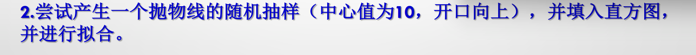

### `exp_overlay.cpp`

```cpp
#include <TCanvas.h>
#include <TRandom3.h>
#include <TFile.h>
#include <TH1D.h>
#include <TF1.h>
#include <TMath.h>
#include <iostream>


void exp_overlay()
{
    TCanvas* c1 = new TCanvas("c1", "c1", 800, 600);
    TFile* store_file = new TFile("exp_overlay.root", "recreate");
    
    // 产生两个随机数产生器
    TRandom3* r1 = new TRandom3(gRandom->Integer(10000));
    TRandom3* r2 = new TRandom3(gRandom->Integer(10000));

    // TH1D hist
    TH1D* h_overlay = new TH1D("h_overlay", "exp overlay", 200, 0, 5);
    TH1D* h_exp5 = new TH1D("exp5", "exp(5)", 200, 0, 5);
    TH1D* h_exp3 = new TH1D("exp3", "exp(3)", 200, 0, 5);

    //sumw2
    h_overlay->Sumw2();
    h_exp5->Sumw2();
    h_exp3->Sumw2();

    for (int i = 0; i < 10000; i++)
    // 填图
    {
        h_overlay->Fill(r1->Exp(5));
        h_overlay->Fill(r2->Exp(3));

        h_exp5->Fill(r1->Exp(5));
        h_exp3->Fill(r2->Exp(3));
    }

    // 画图，注意到这里的图没有拟合，方便和后面的拟合的图进行对比
    h_overlay->Write();
    h_exp5->Write();
    h_exp3->Write();

    // Fit 
    TF1* fit_function = new TF1(
        "fit_function", // 该TF1的ID
        [](double* x, double* par){return par[0] * TMath::Exp(-par[1] * x[0]);}, 
        // 简单地用个lambda表达式，定义了一个指数函数，par是待拟合参数，x是自变量 
        0, // 拟合函数的起始点
        5, // 拟合函数的终点 （说实话在之前的试验中，这个起始点和终点的定义貌似没用）
        2 // 参数个数
    );

    std::cout << "----------------fit exp5--------------" << std::endl;
    h_exp5->Fit(fit_function, "", "", 0, 5);
    std::cout << "--------------------------------------" << std::endl;
    std::cout << std::endl << std::endl << std::endl;

    std::cout << "----------------fit exp3--------------" << std::endl;
    h_exp3->Fit(fit_function, "", "", 0, 5);
    std::cout << "--------------------------------------" << std::endl;
    std::cout << std::endl << std::endl << std::endl;

    std::cout << "------------fit exp5 + exp3-----------" << std::endl;
    h_overlay->Fit(fit_function, "", "", 0, 5);
    std::cout << "--------------------------------------" << std::endl;
    // Fit，这里的参数是：拟合函数（上面的TF1），选项，画图选项，拟合函数的起始点，拟合函数的终点
    // 这里的起始点和终点才有用，上面的TF1的起始点和终点貌似没用

    h_overlay->Write();
    h_exp5->Write();
    h_exp3->Write();
    // 把拟合过的图写入文件

    store_file->Close();
}

```

### 结果


---

---

---



### square_func_fit.cpp

```cpp
#include<iostream>
#include<TCanvas.h>
#include<TRandom3.h>
#include<TFile.h>
#include<TF1.h>
#include<TH1D.h>
#include<TMath.h>

void square_func_fit()
{
    TCanvas* c1 = new TCanvas("c1", "c1", 800, 600);
    TFile* store_file = new TFile("square_func_fit.root", "recreate");

    TF1* sample_function = new TF1("sample_function", "x * x - 20 * x + 100", -20, 30);
    TH1D* h_sample = new TH1D("h1d", "", 200, -20, 30);
    h_sample->Sumw2();

    for (int i = 0; i < 100000; i++)
    {
        h_sample->Fill(sample_function->GetRandom());
    }

    TF1* fit_function = new TF1(
        "fit_function",
        [](double* x, double* par){return par[0] * x[0] * x[0] + par[1] * x[0] + par[2];},
        -20,
        30,
        3
    );

    h_sample->Fit(fit_function, "", "", -20, 30);

    h_sample->Write();
    store_file->Close();
}

```

### 结果


