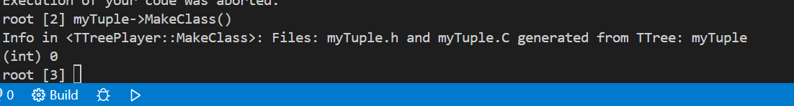

# 使用MakeClass

> root文件的生成使用ppt上的那个代码
>
> 




修改类成员

### 增加变量声明


### 补充初始化函数


### Loop里面加点东西


### 运行这个东西


### 结果


# 使用root script

```cpp
#include <iostream>
#include <TCanvas.h>
#include <TH1.h>
#include <TFile.h>
#include <fstream>
#include <string>
#include <TMath.h>
#include <TF1.h>

void draw_pt_rapidity()
{
    TCanvas* c1 = new TCanvas("c1", "c1", 800, 800);
    TH1F* h1 = new TH1F("h1", "pt distribution", 300, 0, 30000);
    // 通过多次尝试可以发现pt的最大值在30000左右

    TH1F* h2 = new TH1F("h2", "rapidity distribution", 100, 0, 6);

    h1->GetXaxis()->SetTitle("p_{T} [GeV]");
    h1->GetYaxis()->SetTitle("Entries");
    h1->Sumw2();

    h2->GetXaxis()->SetTitle("rapidity");
    h2->GetYaxis()->SetTitle("Entries");
    h2->Sumw2();

    std::ifstream in("/home/huinaibing/huinaibingLinux/root_code/root_hw/15_root/DATA_FILES/data_input.txt");
    
    std::string _;
    double px, py, pz, e;

    while (!in.eof())
    {
        in >> _ >> px >> py >> pz >> e;
        h1->Fill(TMath::Sqrt(px * px + py * py));
        // 填充pT图

        h2->Fill(0.5 * TMath::Log((e + pz) / (e - pz)));
        // 填充快度图
    }

    TFile* root_file = new TFile("root_file.root", "RECREATE");
    // h1->Draw();
    // c1->Write();

    
    h1->Write();
    h2->Write();
    
    root_file->Close();
    in.close();
}

```


