> 常见的算法有Bayesian、SVD等等

# Bayesian

> https://indico.cern.ch/event/107747/contributions/32648/attachments/24323/35007/bierwagen.pdf

贝叶斯Unfold在1994年被引入（D'Agostini G. A multidimensional unfolding method based on Bayes' theorem[J]. Nuclear Instruments and Methods in Physics Research Section A: Accelerators, Spectrometers, Detectors and Associated Equipment, 1995, 362(2-3): 487-498.），该方法在不确定性的计算上存在问题

Bayesian Unfolding)的过程可以用原因 C和结果 E来解释。其中，原因对应于弥散 (smearing) 前的真实值，结果对应于弥散后的测量值。每个原因可以产生不同的结果，但在给定的测量结果下，确切的原因却是未知的。然而，如果对迁移、效率和分辨率有一定的了解，则可以从一个确定的原因估计产生某个结果的概率 P(Ej∣Ci)。这通常通过Monte Carlo模拟来实现。现在的目标是估计观测到的结果 Ej是由不同原因 Ci造成的概率 P(Ci∣Ej)。这个问题不能简单地通过反演来解决，但贝叶斯定理提供了一个方法。

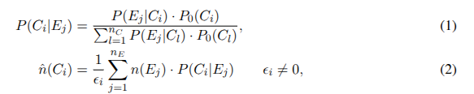

# SVD

Hoecker, A., & Kartvelishvili, V. (1996). SVD approach to data unfolding. *Nuclear Instruments and Methods in Physics Research Section A: Accelerators, Spectrometers, Detectors and Associated Equipment*, *372*(3), 469-481.

高能物理实验中测量的分布通常会因各种探测器效应而发生畸变和变换。文章基于响应矩阵的奇异值分解 (SVD)，重新提出了一种展开这些分布的正则化方法。

设一个测量可观测量的分布存储在一个维度为 nb 的向量 b 中，其中向量的第 i 个坐标包含直方图相应区间的条目数。测量结果会受到有限的实验分辨率和/或探测器的有限接受度的影响，因此来自真实分布的每个事件都可能位于一系列（不一定）相邻的区间中，或者根本不在任何地方。假设我们能够模拟该可观测量的测量过程（例如使用
蒙特卡洛）。我们根据对底层物理过程的一些理解，生成维度为 nx 的分布 xini，并执行探测器模拟。在此阶段，测量区间中的每个条目（即每个事件）都可以直接追溯到其源头。这为我们提供了一个定义明确的模拟真实分布和测量分布之间的线性关系系统：

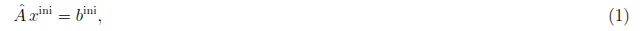

nb × nx 的矩阵A 是一个概率矩阵，它实际上执行模拟折叠过程。现在，给定A 和 xini，对于使用由其响应矩阵A 描述的探测器进行实际测量获得的任何向量 b，都可以尝试找到相应的展开真实分布 x。众所周知，尝试求解
线性方程组

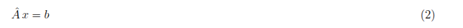

直接对 x 进行矩阵的精确求逆通常会导致完全不可接受的快速振荡解。基于响应矩阵 A 的 SVD，提出一种相对简单直接的正则化方法，该方法可以抑制解中虚假的、快速振荡的成分，只留下统计上显著的项。

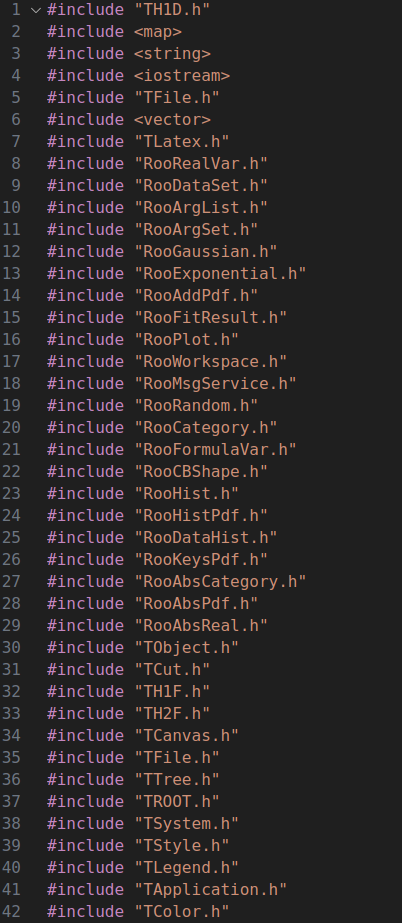

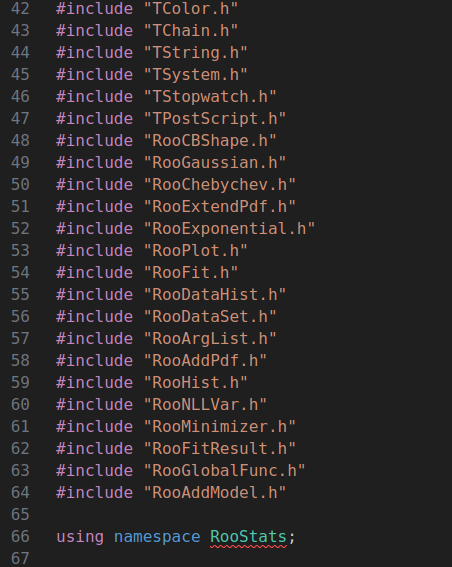

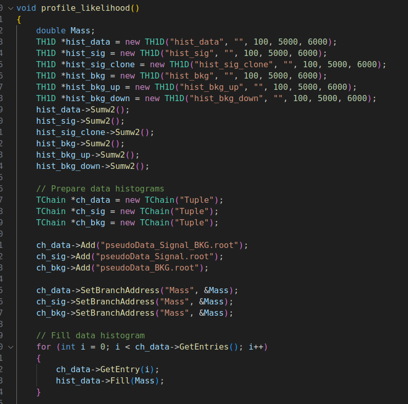

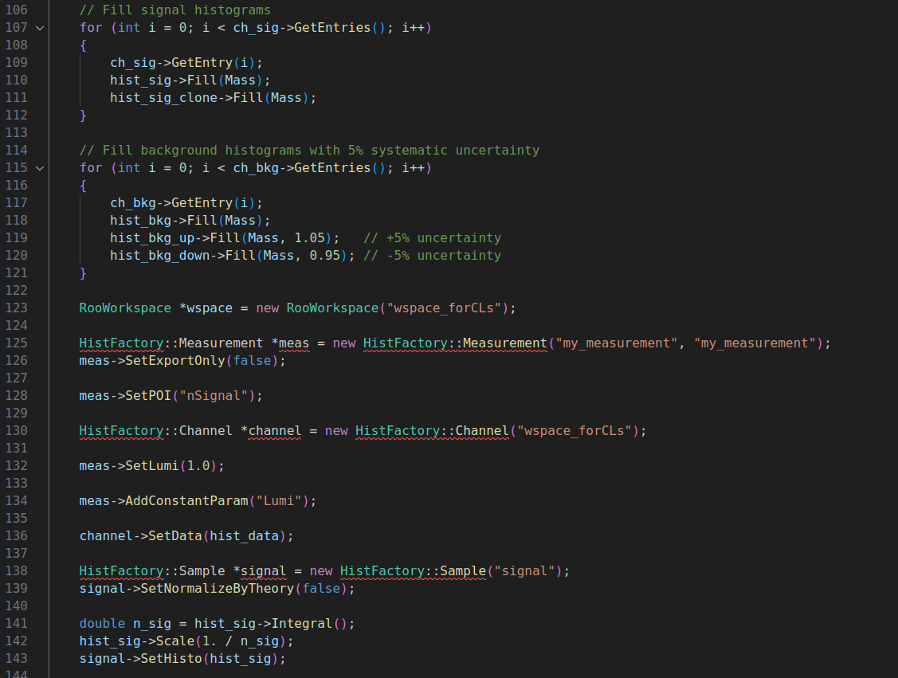

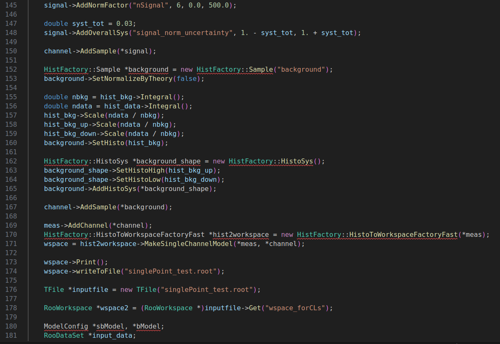

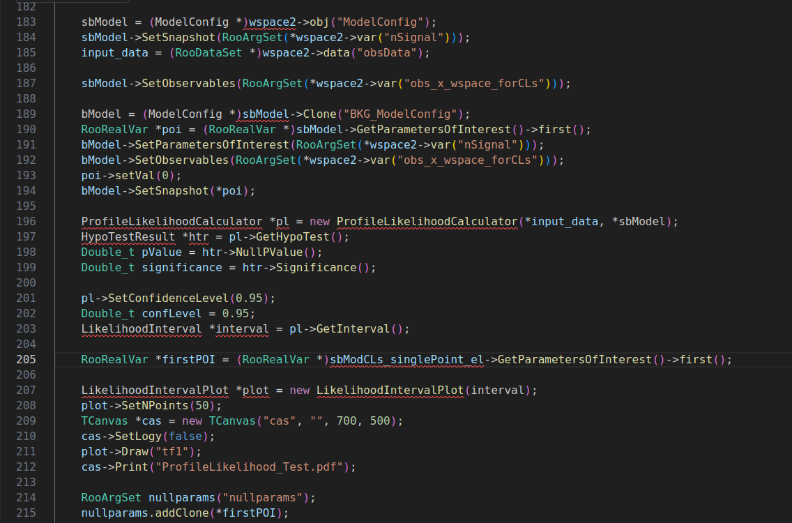

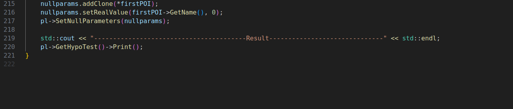

# 结果

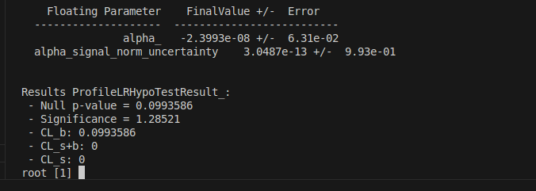

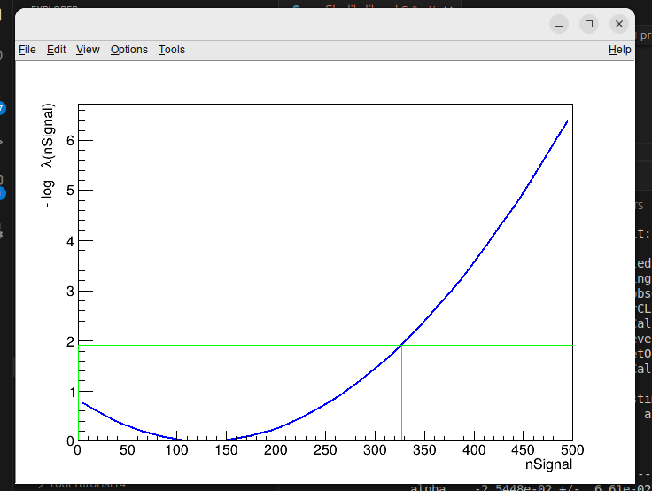
