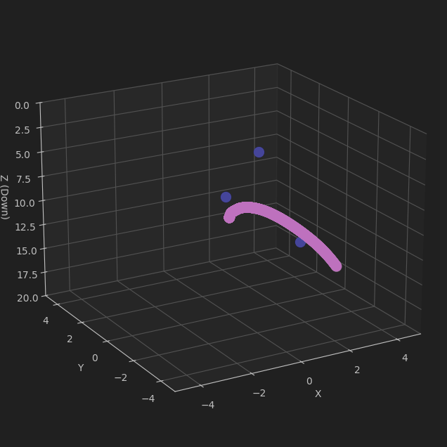
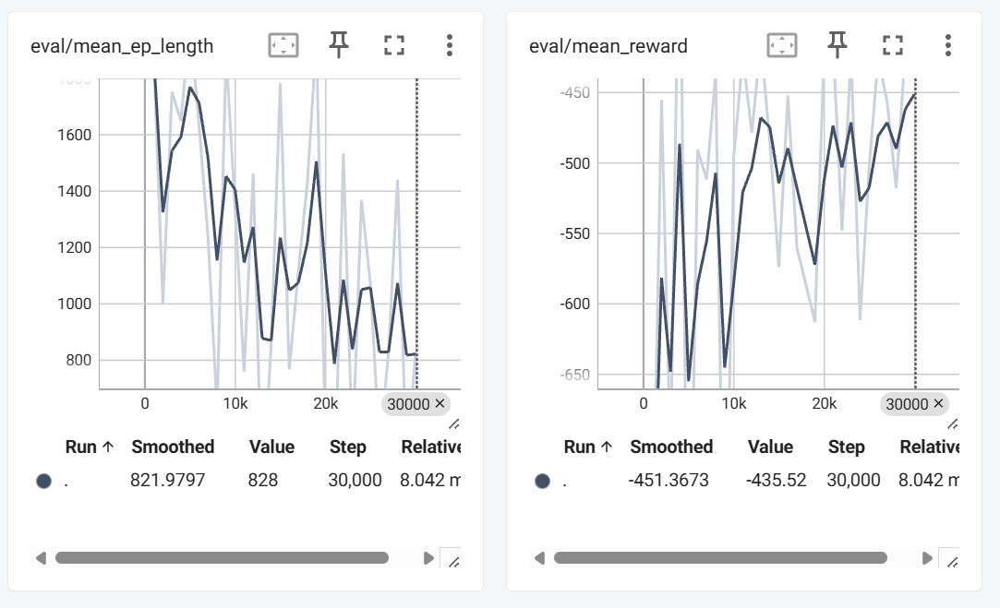
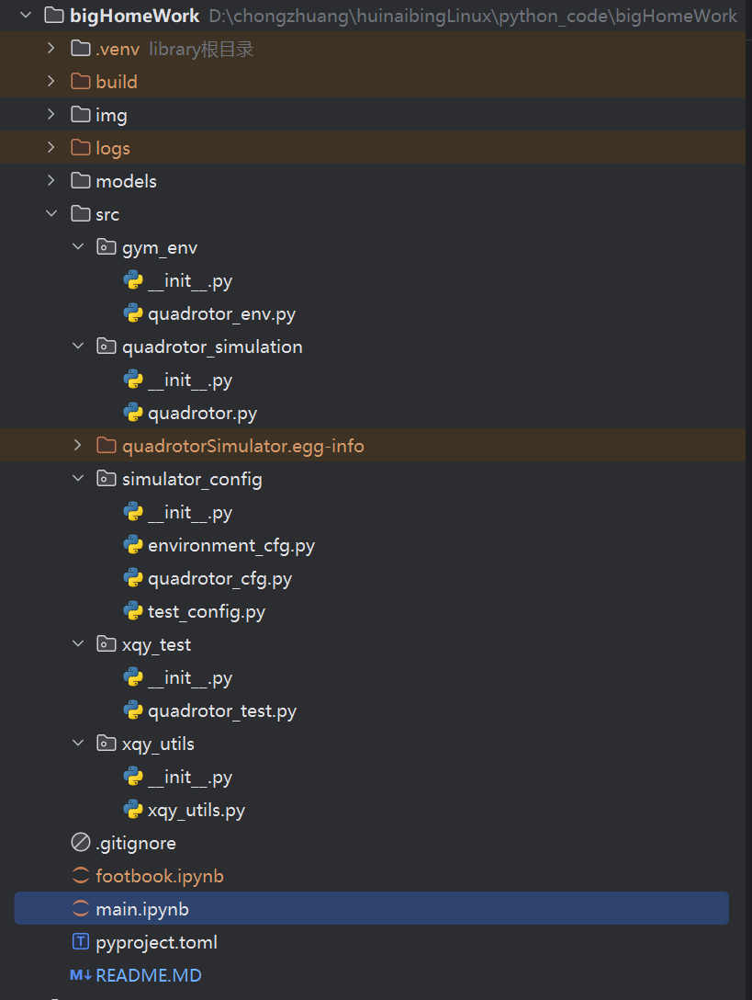
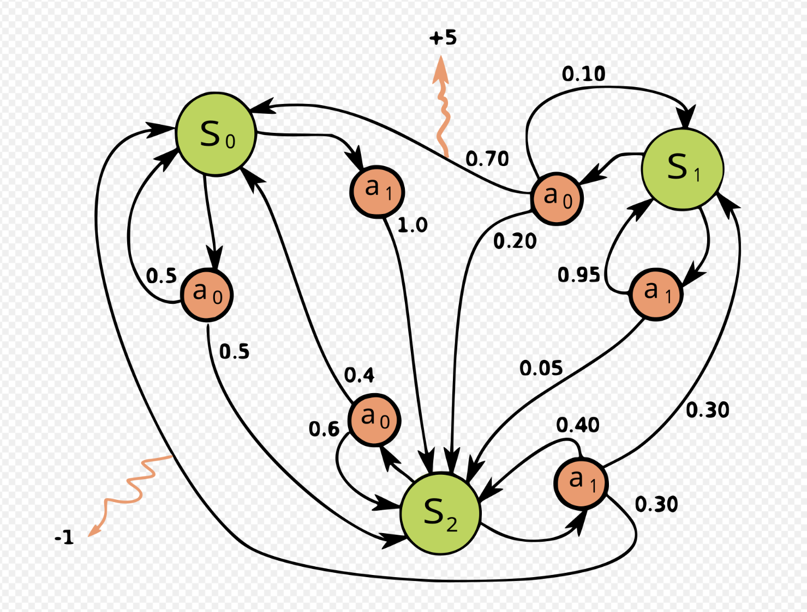
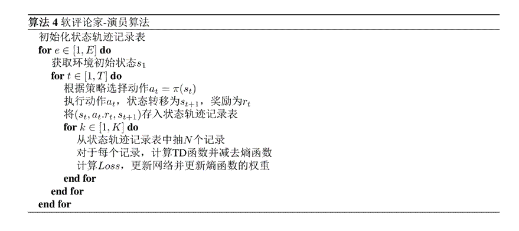

# 夏秋雨
## 2024112200
# 四旋翼无人机


# 结果展示

图中，蓝色点为目标，红色线为无人机飞行路径

由于航空专业喜欢使用z轴朝地心，故这里使用同样坐标系

可以看到，目标点设置为**在其周围一定距离**就视为通过无人机，无人机可飞过两个目标点，第三个目标点较为困难




下图为训练曲线**（tensorboard）**

图一为每次训练的时长，可以看到，智能体在训练中，飞往目标点的平均速度变快，耗时减少

图二为训练的reward，可以看到，智能体通过训练，获得的reward在逐步上升




# 项目结构



- img: 存储本README的图片的文件夹
- logs：训练过程中的日志文件，记录了每次训练的信息
- models：训练的模型，也包括了训练参数
- src：源文件
  - gym_env:强化学习环境设置，使用gymnasium的接口
  - quadrotor_simulation：无人机仿真
  - simulator_config:配置文件，如果需要更改环境参数需要修改这里
  - xqy_test：测试代码，用于debug，可以忽略
  - xqy_utils：工具类，包含各种通用代码
- .gitignore
- main.ipynb：用于训练强化学习模型的notebook,虽然它叫main，但是大部分代码都不在这
- **pyproject.toml：安装信息文件**，非常重要，如果不安装将无法使用
- README.MD：您正在读的文件


# Environment setup 重要！！！我写了个pyproject.toml，需要安装一下

```bash
# 安装pytorch和gymnasium
# 除了pytorch建议自己安装以外
# 其他的软件包会在pip install .的时候自动安装
# 如果dependences写漏了的话，请自行补上缺失软件
pip3 install torch torchvision torchaudio --index-url https://download.pytorch.org/whl/cu128

# 安装我的软件包
cd /path/to/the/pyproject.toml
pip3 install .
```


# 如何使用我的代码复现训练

请在安装完项目后，打开main.ipynb

1. 修改simulator_config下的配置
2. `cd /path/to/the/pyproject.toml && pip install .`
3. 修改run_id（在4号单元格，**如果不修改的话会把训练好的文件覆盖**）


# 运动方程求解

这一部分的公式见Quadrotor Dynamics and Control，Randal W. Beard，Brigham Young University，参考[6]，我可能没写详细，详细请看这本讲义

## 参考系

地球参考系如下，这里按照教材的来，z方向指向地心，在没有翻转的情况下，飞机参考系和地球一样


## 刚体旋转

无人机的俯仰角、翻滚角、偏航角***对应着欧拉旋转的Z-Y-X顺序***。

从***实验室系到无人机系***的转化如下

1. 偏航角$\psi$：绕着实验室坐标系的Z旋转
2. 俯仰角$\theta$：绕着新坐标系的Y轴旋转
3. 翻滚角$\phi$：绕着新坐标系（第二次旋转的新坐标系）的x轴旋转

### vehicle-1参考系

旋转出$\psi$角的矩阵如下，简而言之，就是在上图的***没有旋转的***飞机坐标系中按右手定则旋转k轴
$$
R_v^{v1} = 
\left(
\begin{matrix} 
	\cos \psi & \sin\psi & 0 \\
	-\sin \psi & \cos\psi & 0 \\
	0 & 0& 1
\end{matrix}
\right)
$$


### vehicle-2参考系

旋转出theta角，简而言之，在vehicle-1参考系下旋转j轴
$$
R_{v1}^{v2} = 
\left(
\begin{matrix}
	\cos \theta & 0 & -\sin \theta\\
	0 & 1 & 0 \\ 
	\sin\theta & 0 & \cos \theta
\end{matrix}
\right)
$$


### body参考系

在vehicle-2参考系旋转i轴
$$
R_{v2}^b = 
\left(
\begin{matrix}
	1 & 0 & 0 \\ 
	0 & \cos \phi & \sin\phi \\
	0 & -\sin\phi & \cos \phi
\end{matrix}
\right)
$$

> 所以，从vehicle参考系（和地球坐标轴一样方向的参考系）转到body参考系（刚体旋转后的参考系）变换如下
>
> 
>
> 如果我们想把一个body参考系的矢量转回vehicle参考系，***比如说body参考系下的升力***，由于旋转矩阵
> $$
> R^{-1} = R^T
> $$
> 所以很好处理，就是顺序别搞反

这里为了避免奇点问题，规定

> 如果theta超过这个边界，则判定失败

$$
\psi \in [-180\degree, 180\degree]

    \\

   \theta \in (-90\degree, 90\degree)

   \\

  \phi \in [-180\degree, 180\degree]
$$


如下图，这里简化旋翼无人机的结构，设四个旋翼是对称的,距离机体的重心为d，且在机体坐标系的x和y轴上


上图中x正轴是1号，y正轴是2号，x负轴是3号，y负轴是4号

众所周之，刚体运动可以被分为平动加转动，分开进行分析

在此之前，设升力正比于转速平方，如下图所示，数据来源于参考[5]


## 平动

设四个旋翼的升力为F，方向朝-z轴，如下，Drag为空气阻力，假设他正比于速度
$$
\begin{align}
	F_{body} &= \sum_{i=1}^4 F_i = \left[\begin{matrix}0 \\ 0 \\ -T \end{matrix}\right]
	\\
	F_{lab} &= (R_v^{v1})^T (R_{v1}^{v2})^T (R_{v2}^b)^T F_{body}
	\\
	r &= \left[\begin{matrix}x \\ y \\ z \end{matrix}\right]
	\\
	Gravity_{lab} &= \left[\begin{matrix}0 \\ 0 \\ mg \end{matrix}\right]
	\\
	Drag_{lab} &= -k \dot r
	\\
	m\ddot r &= F_{lab} +Gravity_{lab} + Drag_{lab}
\end{align}
$$


## 转动

如下所示，直接套公式即可

值的一提的是，***无人机存在一个旋翼反扭矩的东西，要不然没有东西提供$M_z$***,详情见参考[4,5]，设这个反扭矩系数为c

另外，由于假设的机体高度对称，所以设$I_x = I_y$，这很符合我画的图

> 这里还设四个旋翼两顺时针两逆时针,这样反扭矩可以是负数，并且更符合实际
>
> 1、3逆时针，2、4顺时针


$$
\begin{align}
	I_x \dot\omega_x + (I_z - I_y)\omega_y\omega_z&=M_x
	\\
	I_y \dot\omega_y + (I_x - I_z)\omega_z\omega_x&=M_y
	\\
	I_z \dot\omega_z + (I_y - I_x)\omega_x\omega_y&=M_z
\end{align}
$$
$$
\begin{align}
	M_x &= d(T_2 - T_4) 
	\\
	M_y &= d(T_3 - T_1)
	\\
	M_z &= c(T_1+T_3 - T_2 - T_4)
\end{align}
$$

接下来，需要计算body坐标系的角速度和刚体姿态角的关系，直接看参考文献[6]的2.2节公式（8）

$$
\left(
\begin{matrix}
	\dot \phi \\ \dot \theta \\ \dot \psi
\end{matrix}
\right)
=
\left(
\begin{matrix}
1 & \sin\phi \tan\theta & \cos \phi \tan \theta \\
0 & \cos\phi & -\sin \phi \\
0 & \sin\phi\sec\theta&\cos\phi\sec\theta
\end{matrix}
\right)

\left(
\begin{matrix}
\omega_x \\\omega_y\\\omega_z
\end{matrix}
\right)
$$
至此，所有的变量都可以被迭代出来


# 迭代状态(物理过程，强化学习迭代过程在后面)

这里就用简单的迭代方法（显示欧拉法）

> 如果theta迭代过了边界，则判定飞行失败
>
> 另外两个角转换范围方法如下
>
> 1. 对2 * pi取余数
> 2. 如果结果大于pi，减去2*pi

平动
$$
\begin{align}
	m\dot v &= F_{sum}
	\\
	v_{t+1} &= \dot v \cdot dt + v_t
	\\
	r_{t + 1} &= v_{t} \cdot dt + r_t
\end{align}
$$
转动
$$
\begin{align}
	\left[
	\begin{matrix}
		\phi_{t+1}
		\\
		\theta_{t+1}
		\\
		\psi_{t+1}
	\end{matrix}
	\right]
	&= 
	\left[
	\begin{matrix}
		\phi_{t}
		\\
		\theta_{t}
		\\
		\psi_{t}
	\end{matrix}
	\right]
	+ 
	dt \cdot
	\left[
	\begin{matrix}
		\dot\phi
		\\
		\dot\theta
		\\
		\dot\psi
	\end{matrix}
	\right]
	\\
	
	\left[
	\begin{matrix}
		\omega_x^{t+1}
		\\
		\omega_y^{t+1}
		\\
		\omega_z^{t+1}
	\end{matrix}
	\right]
	&= 
	\left[
	\begin{matrix}
		\omega_x^{t}
		\\
		\omega_y^{t}
		\\
		\omega_z^{t}
	\end{matrix}
	\right]
	+ 
	dt \cdot
	\left[
	\begin{matrix}
		\dot\omega_x
		\\
		\dot\omega_y
		\\
		\dot\omega_z
	\end{matrix}
	\right]
\end{align}
$$


# 强化学习算法

这里使用SAC，soft actor critic

*以下内容摘自我的本科毕设*


## 马尔可夫决策过程

马尔可夫决策过程（英语：Markov decision process，MDP）是离散时间随机控制过程。它提供了一个数学框架，用于在结果部分随机且部分受决策者控制的情况下对决策建模[9]。MDP 被定义为一个四元组(S A P R) ，其中,S A 为集合，分别包含一系列状态和动作，,P R 为, ,s sprime a的函数，代表采取动作a 后，从状态s 转移到sprime的概率以及奖励。在 MDP 中，决策者在某一个时间点会看到某个状态 s，决策者可以自由决定自己所要采取的动作 a，在采取该动作后，状态会根据状态转移函数 P 转移到一个新的状态，转移到某个状态的概率由该函数给定，在完成状态转移之后，决策者会根据奖励函数 R 获得奖励，以此循环往复直到结束。MDP 的一个重要性质即为当前过程的状态转移和奖励与历史的状态动作无关，在实际问题中我们常常简单地认为历史状态动作不会影响当前的状态转移与奖励，以便将实际问题建模为 MDP。




## 强化学习

强化学习是指在智能体与环境交互的过程中，智能体的某些行为会因为应用“强化操作符”的结果而在未来变得更多或者更少。强化操作符只是从已经发生的行为中选择训练者喜欢的那部分。因此，该过程包含一个智能体，它产生各种行为，与环境互动，以及一个训练者，他决定如何使用强化操作符[9]。强化学习来源于心理学中有机体和环境的交互的理论，后来人们受到其启发，使用计算机模拟心理学过程，加以神经网络的理论，逐渐发展出了如今的强化学习理论。一个简单的强化学习例子是：智能体在时刻 t 观察到了环境状态为 s，根据智能体自己的某种判断策略，采用动作 a，在下一个时刻环境因为智能体的动作 a，转移到了状态 s'，训练者根据环境的变化是否让其满意，给与智能体奖励或惩罚。显然，强化学习过程是马尔可夫决策过程。


## SAC

SAC算法是Actor-critic架构，即策略网络用于指导智能体执行动作（actor），价值网络用于改进actor网络（critic）；SAC使用的是随机策略，相对于固定策略，能探索状态的更多解法，理论上学到的策略可以适应更为复杂的环境。SAC在优化目标中加入了熵函数，使得输出的动作的不确定性增大，熵函数的定义为：

​                

 其中p(x)为随机变量X的分布，其意义是鼓励智能体多加探索，避免算法陷入局部最优解而导致无法继续调优，增强模型的性能，以及增强模型的鲁棒性。下图为SAC算法的伪代码。

|      |                                        |
| ---- | -------------------------------------- |
|      |  |

这里使用stable baseline3这个库直接调用算法


# 展望

1. 四元数迭代姿态避免奇点
   $$
   \begin{align*}
   \mathbf{q}_{t+1} &= \mathbf{q}_t + \frac{dt}{2} \cdot \boldsymbol{\Omega}(\boldsymbol{\omega}_t) \mathbf{q}_t \\
   \boldsymbol{\Omega}(\boldsymbol{\omega}) &= \begin{bmatrix}
   0 & -\omega_x & -\omega_y & -\omega_z \\
   \omega_x & 0 & \omega_z & -\omega_y \\
   \omega_y & -\omega_z & 0 & \omega_x \\
   \omega_z & \omega_y & -\omega_x & 0
   \end{bmatrix}, \quad 
   \mathbf{q} = \begin{bmatrix} q_w \\ q_x \\ q_y \\ q_z \end{bmatrix}
   \end{align*}
   $$

2. 显示欧拉法精度比较差，可换用更好方法

3. 万向节锁问题，当theta为正负90度时会出现该问题，这里简单地判定当其越界时训练truncated，但是如果我们想使用特技飞行无人机的时候（倒着开飞机），必须面对这个问题

4. 训练参数的优化，这里可以加更多的reward机制，以帮助达到训练目标；reward的大小也是一个值得深究的问题

5. 可以使用更多的强化学习模型

6. 无人机的位置和姿态角、旋翼位置存在对称性，可以尝试使用Van der Pol E, Worrall D, van Hoof H, et al. Mdp homomorphic networks: Group symmetries in reinforcement learning[J]. Advances in Neural Information Processing Systems, 2020, 33: 4199-4210. 这个文献中的方法去优化训练

   

# references

[1] SCHULMAN J, FILIP W, DHARIWAL P, et al. Proximal policy optimization algorithms [J]. Machine Learning, 2017.

[2] https://zh.wikipedia.org/wiki/%E6%97%8B%E8%BD%AC%E7%9F%A9%E9%98%B5

[3] https://hrl.boyuai.com/chapter/intro

[4] https://zhuanlan.zhihu.com/p/150010015

[5] https://blog.csdn.net/weixin_41869763/article/details/113853365

[6] Beard R W. Quadrotor dynamics and control[J]. Brigham Young University, 2008, 19(3): 46-56.

[7] https://gymnasium.farama.org/introduction/create_custom_env/

[8] Haarnoja T, Zhou A, Abbeel P, et al. Soft actor-critic: Off-policy maximum entropy deep reinforcement learning with a stochastic actor[C]//International conference on machine learning. Pmlr, 2018: 1861-1870.

[9] Minsky M. Steps toward artificial intelligence[J]. Proceedings of the IRE, 1961, 49(1): 8-30.

[10] Bellman R. A Markovian decision process[J]. Journal of mathematics and mechanics, 1957: 679-684.
