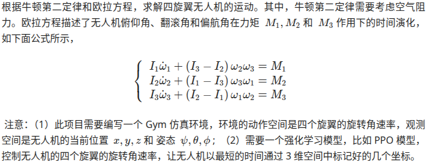
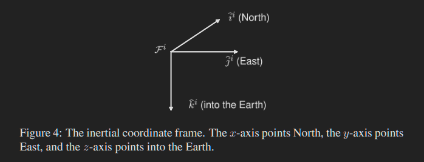
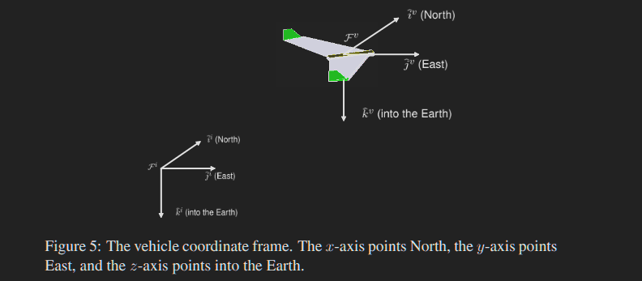
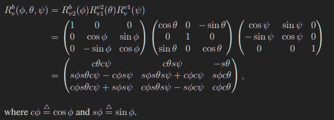
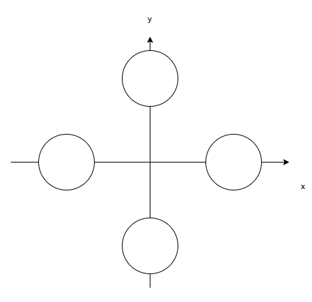

# 夏秋雨
## 2024112200
# 四旋翼无人机



# 运动方程求解

# 这一部分的公式见Quadrotor Dynamics and Control，Randal W. Beard，Brigham Young University，参考[6]，我可能没写详细，详细请看这本讲义

## 参考系

地球参考系如下，这里按照教材的来，z方向指向地心，在没有翻转的情况下，飞机参考系和地球一样





## 刚体旋转

无人机的俯仰角、翻滚角、偏航角***对应着欧拉旋转的Z-Y-X顺序***。

从***实验室系到无人机系***的转化如下

1. 偏航角$\psi$：绕着实验室坐标系的Z旋转
2. 俯仰角$\theta$：绕着新坐标系的Y轴旋转
3. 翻滚角$\phi$：绕着新坐标系（第二次旋转的新坐标系）的x轴旋转

### vehicle-1参考系

旋转出$\psi$角的矩阵如下，简而言之，就是在上图的***没有旋转的***飞机坐标系中按右手定则旋转k轴
$$
R_v^{v1} = 
\left(
\begin{matrix} 
	\cos \psi & \sin\psi & 0 \\
	-\sin \psi & \cos\psi & 0 \\
	0 & 0& 1
\end{matrix}
\right)
$$


### vehicle-2参考系

旋转出theta角，简而言之，在vehicle-1参考系下旋转j轴
$$
R_{v1}^{v2} = 
\left(
\begin{matrix}
	\cos \theta & 0 & -\sin \theta\\
	0 & 1 & 0 \\ 
	\sin\theta & 0 & \cos \theta
\end{matrix}
\right)
$$


### body参考系

在vehicle-2参考系旋转i轴
$$
R_{v2}^b = 
\left(
\begin{matrix}
	1 & 0 & 0 \\ 
	0 & \cos \phi & \sin\phi \\
	0 & -\sin\phi & \cos \phi
\end{matrix}
\right)
$$

> 所以，从vehicle参考系（和地球坐标轴一样方向的参考系）转到body参考系（刚体旋转后的参考系）变换如下
>
> 
>
> 如果我们想把一个body参考系的矢量转回vehicle参考系，***比如说body参考系下的升力***，由于旋转矩阵
> $$
> R^{-1} = R^T
> $$
> 所以很好处理，就是顺序别搞反

这里为了避免奇点问题，规定

> 如果theta超过这个边界，则判定失败

$$
\psi \in [-180\degree, 180\degree]

    \\

   \theta \in (-90\degree, 90\degree)

   \\

  \phi \in [-180\degree, 180\degree]
$$


如下图，这里简化旋翼无人机的结构，设四个旋翼是对称的,距离机体的重心为d，且在机体坐标系的x和y轴上




上图中x正轴是1号，y正轴是2号，x负轴是3号，y负轴是4号

众所周之，刚体运动可以被分为平动加转动，分开进行分析

在此之前，设升力正比于转速平方，如下图所示，数据来源于参考[5]


## 平动

设四个旋翼的升力为F，方向朝-z轴，如下，Drag为空气阻力，假设他正比于速度
$$
\begin{align}
	F_{body} &= \sum_{i=1}^4 F_i = \left[\begin{matrix}0 \\ 0 \\ -T \end{matrix}\right]
	\\
	F_{lab} &= (R_v^{v1})^T (R_{v1}^{v2})^T (R_{v2}^b)^T F_{body}
	\\
	r &= \left[\begin{matrix}x \\ y \\ z \end{matrix}\right]
	\\
	Gravity_{lab} &= \left[\begin{matrix}0 \\ 0 \\ mg \end{matrix}\right]
	\\
	Drag_{lab} &= -k \dot r
	\\
	m\ddot r &= F_{lab} +Gravity_{lab} + Drag_{lab}
\end{align}
$$


## 转动

如下所示，直接套公式即可

值的一提的是，***无人机存在一个旋翼反扭矩的东西，要不然没有东西提供$M_z$***,详情见参考[4,5]，设这个反扭矩系数为c

另外，由于假设的机体高度对称，所以设$I_x = I_y$，这很符合我画的图

> 这里还设四个旋翼两顺时针两逆时针,这样反扭矩可以是负数，并且更符合实际
>
> 1、3逆时针，2、4顺时针


$$
\begin{align}
	I_x \dot\omega_x + (I_z - I_y)\omega_y\omega_z&=M_x
	\\
	I_y \dot\omega_y + (I_x - I_z)\omega_z\omega_x&=M_y
	\\
	I_z \dot\omega_z + (I_y - I_x)\omega_x\omega_y&=M_z
\end{align}
$$
$$
\begin{align}
	M_x &= d(T_2 - T_4) 
	\\
	M_y &= d(T_3 - T_1)
	\\
	M_z &= c(T_1+T_3 - T_2 - T_4)
\end{align}
$$

接下来，需要计算body坐标系的角速度和刚体姿态角的关系，直接看参考文献[6]的2.2节公式（8）

$$
\left(
\begin{matrix}
	\dot \phi \\ \dot \theta \\ \dot \psi
\end{matrix}
\right)
=
\left(
\begin{matrix}
1 & \sin\phi \tan\theta & \cos \phi \tan \theta \\
0 & \cos\phi & -\sin \phi \\
0 & \sin\phi\sec\theta&\cos\phi\sec\theta
\end{matrix}
\right)

\left(
\begin{matrix}
\omega_x \\\omega_y\\\omega_z
\end{matrix}
\right)
$$
至此，所有的变量都可以被迭代出来


# 迭代状态(物理过程，强化学习迭代过程在后面)

这里就用简单的迭代方法（显示欧拉法）

> 如果theta迭代过了边界，则判定飞行失败
>
> 另外两个角转换范围方法如下
>
> 1. 对2 * pi取余数
> 2. 如果结果大于pi，减去2*pi

平动
$$
\begin{align}
	m\dot v &= F_{sum}
	\\
	v_{t+1} &= \dot v \cdot dt + v_t
	\\
	r_{t + 1} &= v_{t} \cdot dt + r_t
\end{align}
$$
转动
$$
\begin{align}
	\left[
	\begin{matrix}
		\phi_{t+1}
		\\
		\theta_{t+1}
		\\
		\psi_{t+1}
	\end{matrix}
	\right]
	&= 
	\left[
	\begin{matrix}
		\phi_{t}
		\\
		\theta_{t}
		\\
		\psi_{t}
	\end{matrix}
	\right]
	+ 
	dt \cdot
	\left[
	\begin{matrix}
		\dot\phi
		\\
		\dot\theta
		\\
		\dot\psi
	\end{matrix}
	\right]
	\\
	
	\left[
	\begin{matrix}
		\omega_x^{t+1}
		\\
		\omega_y^{t+1}
		\\
		\omega_z^{t+1}
	\end{matrix}
	\right]
	&= 
	\left[
	\begin{matrix}
		\omega_x^{t}
		\\
		\omega_y^{t}
		\\
		\omega_z^{t}
	\end{matrix}
	\right]
	+ 
	dt \cdot
	\left[
	\begin{matrix}
		\dot\omega_x
		\\
		\dot\omega_y
		\\
		\dot\omega_z
	\end{matrix}
	\right]
\end{align}
$$


# Environment setup

# 重要！！！我写了个pyproject.toml，需要安装一下

> gymnasium version 1.1.1
>
> torch version 2.7.1+CPU(实验室Ubuntu24) 2.7.1+cu126(个人笔记本电脑)

```bash
# 安装pytorch和gymnasium
# gymnasium是gym的升级版，不建议在用gym了
# 命令仅供参考，可去官网查找安装命令
pip3 install torch torchvision torchaudio --index-url https://download.pytorch.org/whl/cu128
pip3 install gymnasium
# 安装我的软件包
cd /path/to/the/pyproject.toml
pip3 install .
```


# 改进

1. 四元数迭代姿态避免奇点
   $$
   \begin{align*}
   \mathbf{q}_{t+1} &= \mathbf{q}_t + \frac{dt}{2} \cdot \boldsymbol{\Omega}(\boldsymbol{\omega}_t) \mathbf{q}_t \\
   \boldsymbol{\Omega}(\boldsymbol{\omega}) &= \begin{bmatrix}
   0 & -\omega_x & -\omega_y & -\omega_z \\
   \omega_x & 0 & \omega_z & -\omega_y \\
   \omega_y & -\omega_z & 0 & \omega_x \\
   \omega_z & \omega_y & -\omega_x & 0
   \end{bmatrix}, \quad 
   \mathbf{q} = \begin{bmatrix} q_w \\ q_x \\ q_y \\ q_z \end{bmatrix}
   \end{align*}
   $$
   
2. 显示欧拉法精度比较差，可换用更好方法

3. 万向节锁问题，当theta为正负90度时会出现该问题

# references

[1] SCHULMAN J, FILIP W, DHARIWAL P, et al. Proximal policy optimization algorithms [J]. Machine Learning, 2017.

[2] https://zh.wikipedia.org/wiki/%E6%97%8B%E8%BD%AC%E7%9F%A9%E9%98%B5

[3] https://hrl.boyuai.com/chapter/intro

[4] https://zhuanlan.zhihu.com/p/150010015

[5] https://blog.csdn.net/weixin_41869763/article/details/113853365

[6] Beard R W. Quadrotor dynamics and control[J]. Brigham Young University, 2008, 19(3): 46-56.

[7] https://gymnasium.farama.org/introduction/create_custom_env/


